# Predikcia dažďa v Austrálii — Zhrnutie projektu

**Predmet:** IB031 Úvod do strojového učenia  
**Dataset:** Daily Weather Observations — Austrália (2008–2017), ~156 000 záznamov, 49 lokalít  
**Cieľové premenné:** `RainTomorrow` (binárna) a `RISK_MM` (spojitá — množstvo zrážok v mm)

---

## 1. Exploračná analýza

### 1.1 Chýbajúce hodnoty

Najvýraznejšie chýbajú údaje o slnečnom svite, evaporácii a oblačnosti (30–48 %) — pravdepodobne nie sú merané na všetkých staniciach. Cieľové premenné sú kompletné.

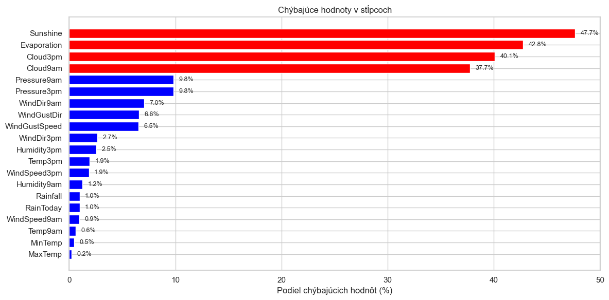

Chýbanie hodnôt nie je náhodné — stanice s chýbajúcimi údajmi majú odlišný podiel dažďových dní, čo naznačuje mechanizmus MAR (Missing At Random, závislé na lokalite).

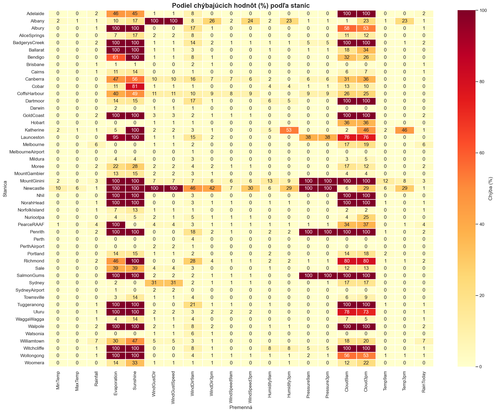

### 1.2 Distribúcia cieľových premenných

Dataset je **nevyvážený** — ~77.6 % dní je bez dažďa, ~22.4 % s dažďom (pomer 3.5:1). Samotná accuracy preto nie je dostatočnou metrikou.

`RISK_MM` je silne pravostranné skosená — väčšina dní má nulové zrážky. Pre regresné modely používame logaritmickú transformáciu `log(RISK_MM + 1)`.

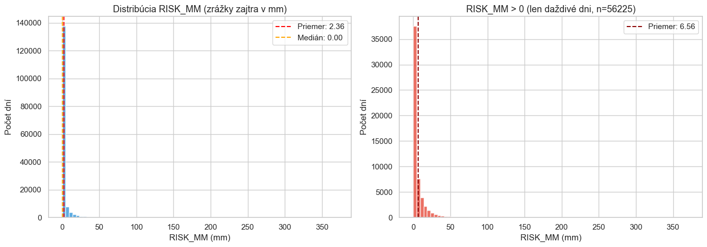

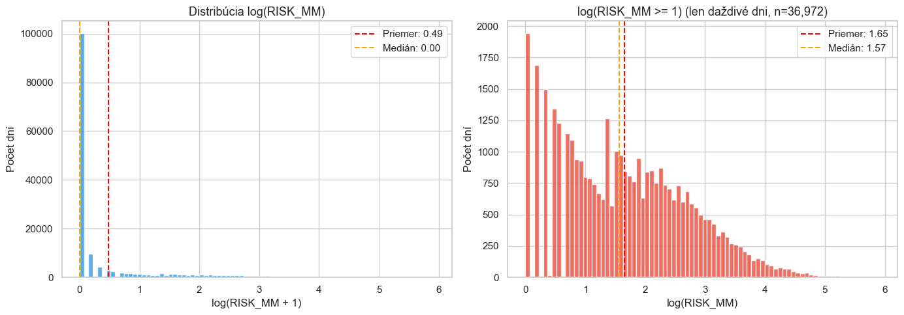

### 1.3 Distribúcie premenných a outliery

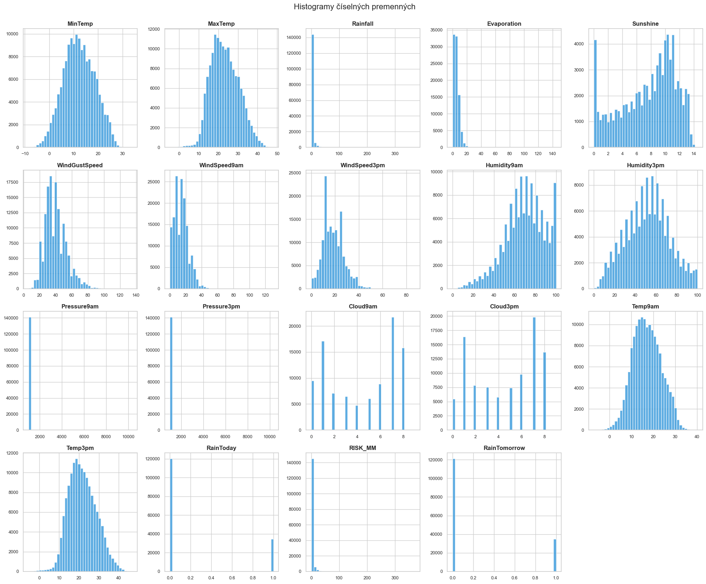

**Zistenia:**

- **Pressure9am/3pm** — extrémne hodnoty (~10 340 hPa) sú chybné, opravené vydelením 10
- **Cloud9am/3pm** — hodnota 9 je nedefinovaná (oktas 0–8), nahradená NaN
- **Rainfall, RISK_MM** — silne skosené, väčšina dní bez zrážok

### 1.4 Sezónne vzory

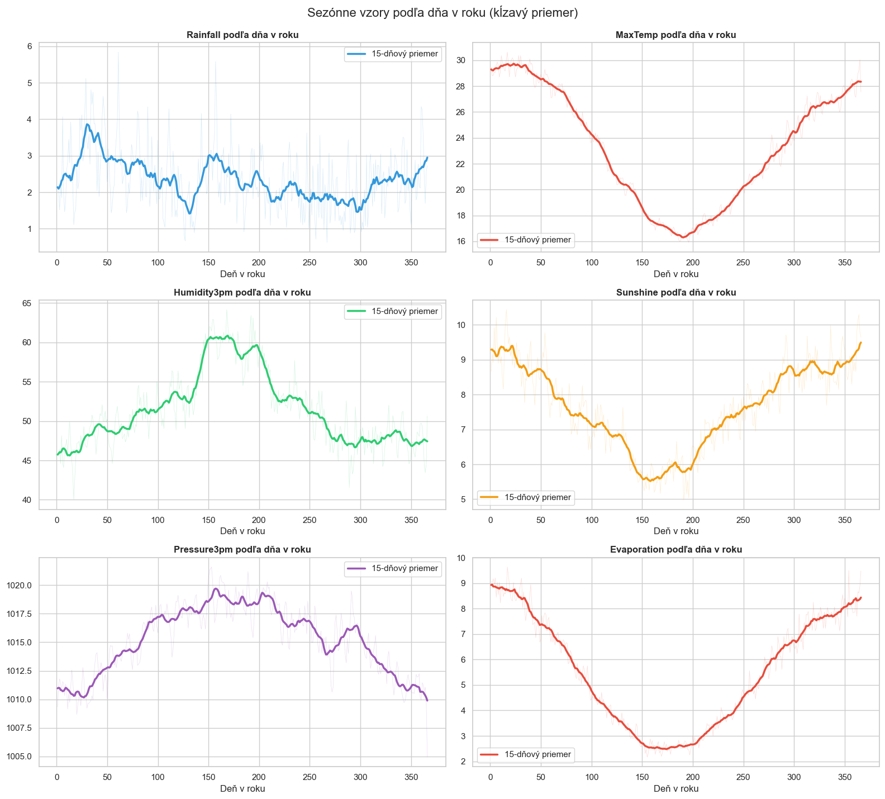

- Zrážky sú najvyššie v lete (jan–mar), najnižšie v zime (jún–aug). Pozn.: Austrália je na južnej pologuli.
- Teplota a slnečný svit logicky kopírujú sezónu.

### 1.5 Smery vetra

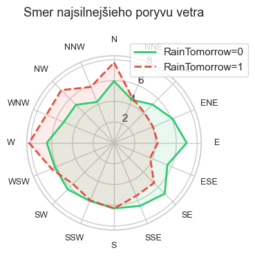

Dažďové dni majú tendenciu mať viac vetra zo **západných a severozápadných** smerov (vlhký vzduch od oceánu), zatiaľ čo suché dni majú častejšie **východné a juhovýchodné** smery.

---

## 2. Imputácia

### 2.1 Regionálne klastrovanie

Stanice rozdelené do **9 regiónov** pomocou K-Means na súradniciach. Imputácia mediánom (číselné) a modom (kategorické) **v rámci regiónu**, s globálnym fallbackom.

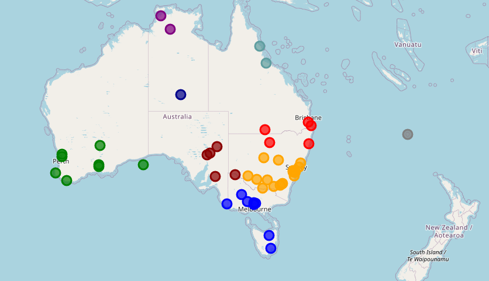

### 2.2 Indikátory chýbania

Pre každý imputovaný stĺpec vytvorený binárny flag `*_imputed` (0/1) — aby model mohol využiť informáciu o tom, či hodnota bola pôvodne chýbajúca.

---

## 3. Feature Engineering

### 3.1 Kódovanie smerov vetra
- Sin/cos kódovanie pre cyklickú povahu svetových strán (N=0°, E=90°, ...)

### 3.2 Zmeny počas dňa
- `Temp_change`, `Humidity_change`, `Pressure_change`, `Cloud_change`, `WindSpeed_change`
- `Humidity_Pressure` interakcie (vlhkosť × tlak)

### 3.3 Logaritmické transformácie
- `Rainfall_log`, `Evaporation_log`, `WindGustSpeed_log`, `WindSpeed_log` — pre skosené premenné

### 3.4 Časové features
- `Month`, `DayOfYear` — sezónnosť

### 3.5 Korelácie po feature engineeringu

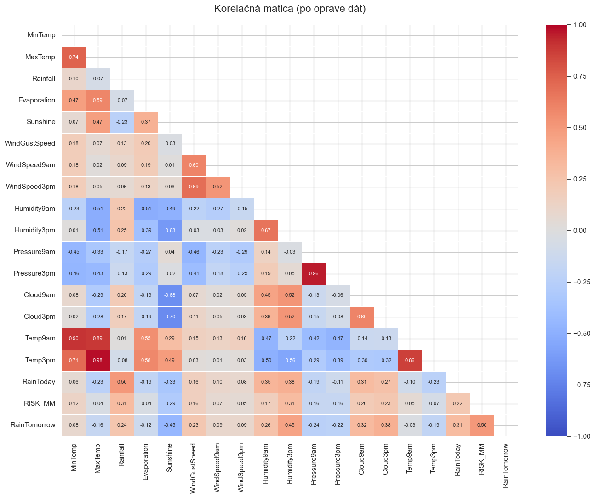

**Najlepšie prediktory RainTomorrow:** Humidity3pm, Sunshine, Cloud3pm, Pressure3pm, WindGustSpeed

---

## 4. Tréning modelov

### 4.1 Feature sety

| Set | Popis | Počet features |
|:--|:--|--:|
| `selected` | Vybrané parametre, ktoré najviac korelovali (3pm hodnoty + zmeny) | ~33 |
| `no_critical` | Bez kriticky chýbajúcich (Sunshine, Evaporation, Cloud) | ~27 |
| `all` | Všetky features | ~68 |
| `original` | Pôvodné neupravené dáta (bez feature engineeringu) | ~24 |

### 4.2 Klasifikácia (RainTomorrow)

Modely: DecisionTree, LogisticRegression, RandomForest  
TimeSeriesSplit (n = 5)
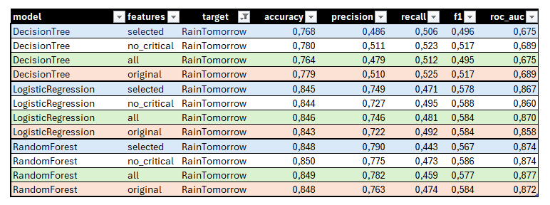

### 4.3 Regresia (RISK_MM)

Modely: LinearRegression, GradientBoosting, RandomForestRegressor  
Target: `log(RISK_MM + 1)`  
TimeSeriesSplit (n = 5)

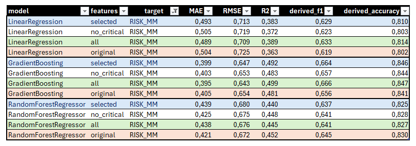

