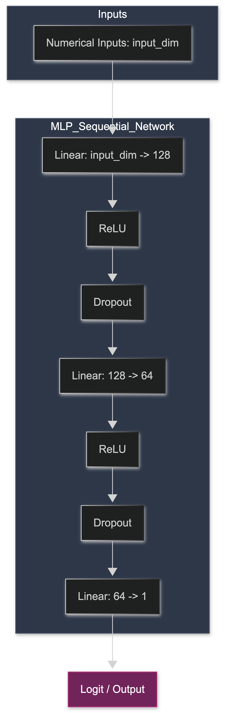
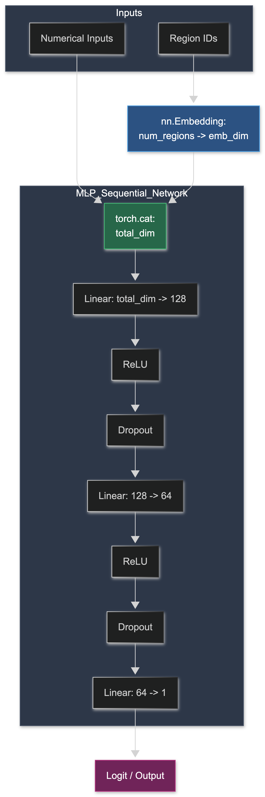

# Predikcia dažďa v Austrálii — Zhrnutie projektu

**Predmet:** IB031 Úvod do strojového učenia  
**Dataset:** Daily Weather Observations — Austrália (2008–2017), ~156 000 záznamov, 49 lokalít  
**Cieľové premenné:** `RainTomorrow` (binárna) a `RISK_MM` (spojitá — množstvo zrážok v mm)

---

## 1. Exploračná analýza

### 1.1 Chýbajúce hodnoty

Najvýraznejšie chýbajú údaje o slnečnom svite, evaporácii a oblačnosti (30–48 %) — pravdepodobne nie sú merané na všetkých staniciach. Cieľové premenné sú kompletné.


Chýbanie hodnôt nie je náhodné — stanice s chýbajúcimi údajmi majú odlišný podiel dažďových dní, čo naznačuje mechanizmus MAR (Missing At Random, závislé na lokalite).


### 1.2 Distribúcia cieľových premenných

Dataset je **nevyvážený** — ~77.6 % dní je bez dažďa, ~22.4 % s dažďom (pomer 3.5:1). Samotná accuracy preto nie je dostatočnou metrikou.

`RISK_MM` je silne pravostranné skosená — väčšina dní má nulové zrážky. Pre regresné modely používame logaritmickú transformáciu `log(RISK_MM + 1)`.


### 1.3 Distribúcie premenných a outliery


**Zistenia:**

- **Pressure9am/3pm** — extrémne hodnoty (~10 340 hPa) sú chybné, opravené vydelením 10
- **Cloud9am/3pm** — hodnota 9 je nedefinovaná (oktas 0–8), nahradená NaN
- **Rainfall, RISK_MM** — silne skosené, väčšina dní bez zrážok

### 1.4 Sezónne vzory


- Zrážky sú najvyššie v lete (jan–mar), najnižšie v zime (jún–aug). Pozn.: Austrália je na južnej pologuli.
- Teplota a slnečný svit logicky kopírujú sezónu.

### 1.5 Smery vetra


Dažďové dni majú tendenciu mať viac vetra zo **západných a severozápadných** smerov (vlhký vzduch od oceánu), zatiaľ čo suché dni majú častejšie **východné a juhovýchodné** smery.

---

## 2. Imputácia

### 2.1 Regionálne klastrovanie

Stanice rozdelené do **9 regiónov** pomocou K-Means na súradniciach. Imputácia mediánom (číselné) a modom (kategorické) **v rámci regiónu**, s globálnym fallbackom.


### 2.2 Indikátory chýbania

Pre každý imputovaný stĺpec vytvorený binárny flag `*_imputed` (0/1) — aby model mohol využiť informáciu o tom, či hodnota bola pôvodne chýbajúca.

---

## 3. Feature Engineering

### 3.1 Kódovanie smerov vetra
- Sin/cos kódovanie pre cyklickú povahu svetových strán (N=0°, E=90°, ...)

### 3.2 Zmeny počas dňa
- `Temp_change`, `Humidity_change`, `Pressure_change`, `Cloud_change`, `WindSpeed_change`
- `Humidity_Pressure` interakcie (vlhkosť × tlak)

### 3.3 Logaritmické transformácie
- `Rainfall_log`, `Evaporation_log`, `WindGustSpeed_log`, `WindSpeed_log` — pre skosené premenné

### 3.4 Časové features
- `Month`, `DayOfYear` — sezónnosť

### 3.5 Korelácie po feature engineeringu


**Najlepšie prediktory RainTomorrow:** Humidity3pm, Sunshine, Cloud3pm, Pressure3pm, WindGustSpeed

---

## 4. Tréning modelov

### 4.1 Feature sety

| Set | Popis | Počet features |
|:--|:--|--:|
| `selected` | Vybrané parametre, ktoré najviac korelovali (3pm hodnoty + zmeny) | ~33 |
| `no_critical` | Bez kriticky chýbajúcich (Sunshine, Evaporation, Cloud) | ~27 |
| `all` | Všetky features | ~68 |
| `original` | Pôvodné neupravené dáta (bez feature engineeringu) | ~24 |

### 4.2 Klasifikácia (RainTomorrow)

Modely: DecisionTree, LogisticRegression, RandomForest  
TimeSeriesSplit (n = 5)


### 4.3 Regresia (RISK_MM)

Modely: LinearRegression, GradientBoosting, RandomForestRegressor  
Target: `log(RISK_MM + 1)`  
TimeSeriesSplit (n = 5)


## 4.4 Neural Networks

### Data:
- `selected` + cos / sin transformace větru a Region ID
- `original`


### Architektura
| **BaselineNN** | **EmbNN** |
| :---: | :---: |
|  |  |

&nbsp;

Entity embeddings elegantně kódují geografickou informaci o Region clusteru do naučeného latentního prostoru, což umožňuje modelu zachytit podobnosti mezi blízkými lokalitami.


Trénink modelu probíhá pomocí **vážené loss funkce** $BCE(w)$, kde váha $w$ kompenzuje nevyváženost tříd v datasetu:

$$w = \frac{n_{negative} + \epsilon}{n_{positive} + \epsilon}$$

**Kde:**  

- $n_{negative}$: počet vzorků třídy 0 (bez deště)
- $n_{positive}$: počet vzorků třídy 1 (déšť)
- $\epsilon$: konstanta $10^{-5}$ pro numerickou stabilitu


### Výsledky
| Model | Třída | Precision | Recall | F1-Score | Accuracy |
| :--- | :---: | :---: | :---: | :---: | :---: |
| **BaselineNN** | 0 (No Rain) | 0.91 | **0.86** | 0.88 | **0.83** |
| | 1 (Rain) | **0.62** | 0.72 | 0.66 | |
| **EmbNN** | 0 (No Rain) | 0.91 | 0.85 | 0.88 | 0.82 |
| | 1    (Rain) | 0.60 | 0.72 | 0.66 | |

Obě sítě dosahují poměrně stejných a vyvážených výsledků kde BaselineNN má v některých metrikách dokonce lepší hodnoty. Klíčový je zde důsledek vážené loss funkce: priorita recall oproti precision. Toto je důležité vzhledem ke klasifikovanému problému kde je lepší minimalizovat False Negatives (do nějaké rozumné míry). Tento fakt byl částečně vykompenzován optimalizací binarizačního thresholdu pro pravděpodobnosti u predikcí vzhledem k F1 score, kde se mírně zvýšil precision na úkor recall pro celkové vyšší F1 a stabilnější predikce u obou modelů. 

**Závěrem se tedy i u experimentu s neurálními sítěmi potvrzuje, že pokročilejší feature engineering (včetně zanesení práce s konkrétní vytvořenou feature přímo do architektury) nevedlo k lepším výsledkům než základní BaselineNN na originálních datech s pouze nutným minimálním processingem.**  

- Základní síť má sama o sobě dostatečnou kapacitu, aby si relevantní features extrahovala z "raw" dat sama.


## 4.5 Cluster-Specific Model

### Metodologie
Austrálie je klimaticky příliš různorodá na jeden globální model. Místo toho trénujeme **9 samostatných Random Forestů** — jeden pro každý geografický cluster. Každý model se učí výhradně na datech svého regionu přes identickou pipeline:

1. **RegionalDateImputer** — imputace chybějících hodnot pouze z trénovacích dat clusteru (bez data leakage)
2. **ColumnTransformer** — zahození `Date`, OneHotEncoding kategorických sloupců (směry větru), numerické featury beze změny
3. **RandomForestClassifier** — 200 stromů, robustní vůči outlierům

### Výhody
- Každý model zachycuje lokální klimatické zákonitosti bez rušení z jiných zón
- Modely jsou nezávislé — selhání jednoho neovlivní ostatní
- Snadná rozšiřitelnost (nový region = nový model)

### Omezení
- Menší trénovací sady u méně zastoupených regionů → vyšší variance
- Bez koordinace mezi modely — přeshraniční jevy (fronty) nejsou zachyceny
- Počet clusterů (9) byl pevně stanoven, jiná granularita nebyla zkoumána
- Imputované hodnoty v některých clusterech mohou mít velké % zastoupení a tím zkreslovat výsledky

### Výsledky
| Cluster | n_train | F1 | AUC |
| :--- | :--- | :--- | :--- |
| Cluster 0 | 13,208 | 0.4339 | 0.8061 |
| Cluster 1 | 19,519 | 0.6054 | 0.8711 |
| Cluster 2 | 20,902 | 0.6427 | 0.8865 |
| Cluster 3 | 3,975 | 0.5363 | 0.8925 |
| Cluster 4 | 45,132 | 0.5708 | 0.8535 |
| Cluster 5 | 11,668 | 0.6171 | 0.9132 |
| Cluster 6 | 5,378 | 0.5476 | 0.8267 |
| Cluster 7 | 2,647 | 0.5843 | 0.8158 |
| Cluster 8 | 2,700 | 0.2597 | 0.8520 |

Cluster-specific modely ukázaly, že segmentace dat může v některých clusterech překonat výkon globálního modelu. Zatímco nejlepší globální model dosáhl **ROC-AUC = 0.877** a **F1 = 0.577**, například **Cluster 5** dosáhl **AUC = 0.913** a **F1 = 0.617** a **Cluster 2** **AUC = 0.887** a **F1 = 0.643**. Naopak některé clustery, například **Cluster 0** nebo **Cluster 8**, vykazovaly slabší výsledky. To naznačuje, že clustering může pomoci odhalit homogennější skupiny dat, ve kterých model dosahuje lepší predikční schopnosti než při použití jednoho globálního modelu.

## 4.6 `predict_rain_australia`

Cluster modely predikují pouze pro svůj region. Tato funkce tento problém řeší: z **jediného pozorování** odhadne pravděpodobnost deště ve **všech 9 regionech** najednou a vrátí souhrnnou metriku `prob_at_least_one` — pravděpodobnost, že právě teď prší někde v Austrálii.

### Metodologie — delta metoda
Přímý přenos naměřených hodnot by byl nesmyslný (80% vlhkost je na severu normál, na jihu extrém). Funkce proto přenáší **relativní odchylku od klimatologické normy**:

```
delta        = pozorování − baseline_src        # anomálie zdrojového regionu
simulováno   = baseline_tgt + delta             # norma cílového regionu + stejná anomálie
```

kde `baseline` = medián regionu pro daný den v roce (`cluster_climatology`). Pro vlastní region se použije skutečné pozorování beze změny.

Výsledná agregace přes **pravidlo doplňku**:

```
prob_at_least_one = 1 − ∏(1 − pᵢ)   pro i = 1..9
```

Stačí jediný cluster s vysokou pravděpodobností a metrika to okamžitě zachytí.

### Výhody
- Přehled pro celou Austrálii z jediného měření
- Delta metoda je interpretovatelná — přenáší "jak moc je dnes abnormální", ne surová čísla
- `prob_at_least_one` kombinuje 9 nezávislých predikcí
- přenáší přehled pravděpodobnosti deště z aktuálně naměřených podmínek do ostatních regionů

### Omezení
- Vzdálenější regiony → méně spolehlivá simulace (lokální jevy jako bouřky se nepřenášejí dobře)
- Historické mediány jsou statické, nereflektují klimatické trendy
- `prob_at_least_one` roste s počtem regionů — při 9 clusterech může být uměle vysoká i při nízkých individuálních pravděpodobnostech
